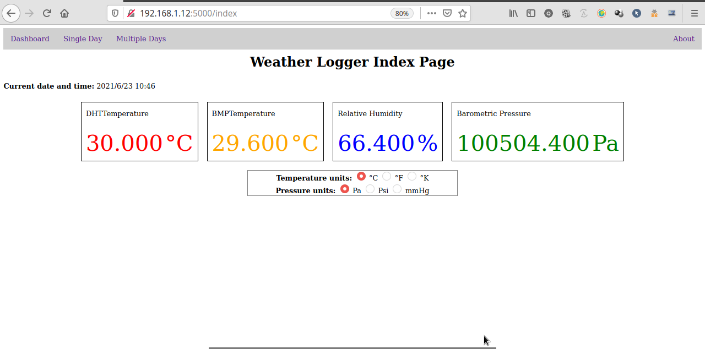
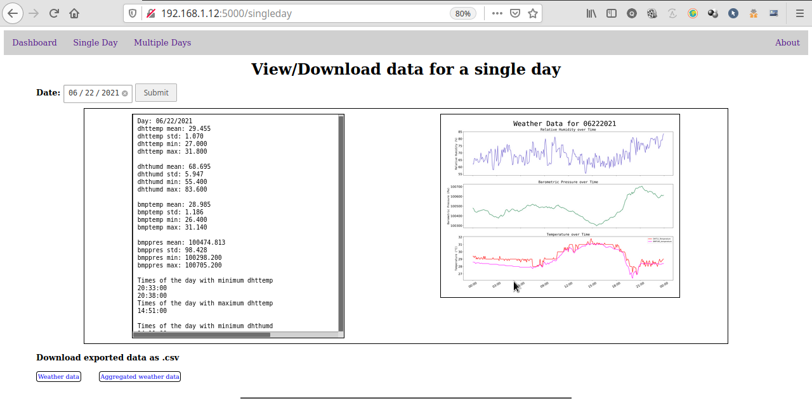
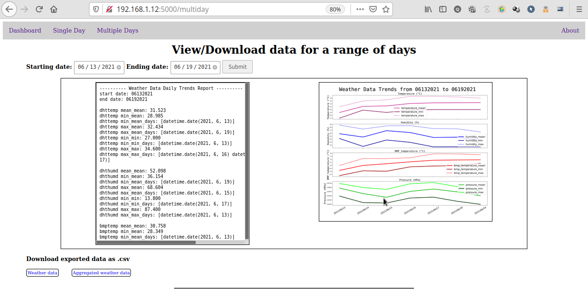
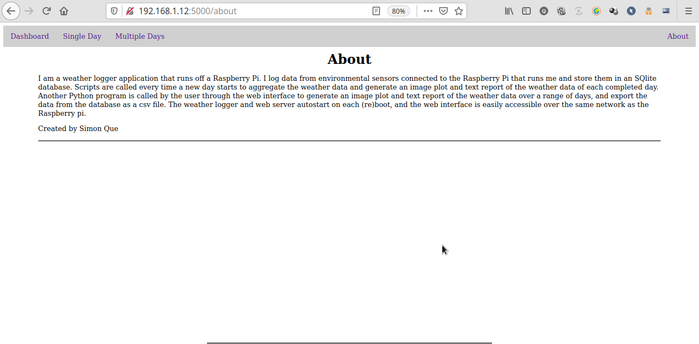
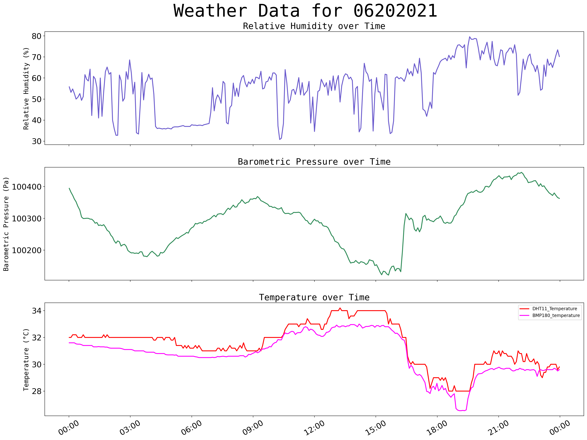
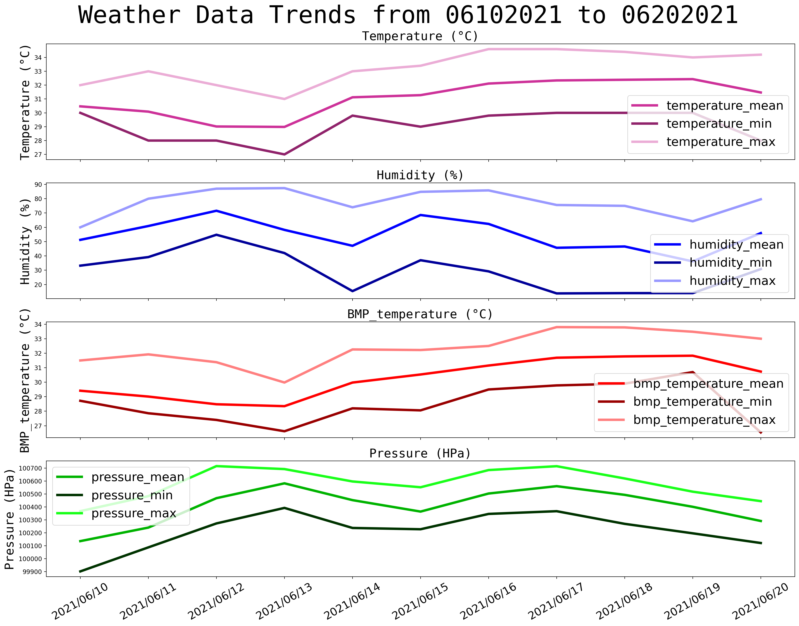
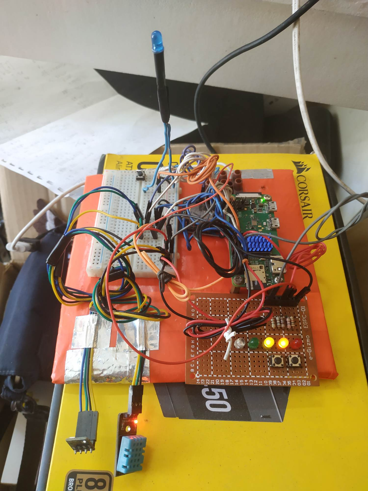

# Raspberry-Pi-Weather-Logger

## Introduction
This application logs weather data - temperature, barometric pressure, and relative humidity data from sensors connected to a Raspberry Pi. The weather data for each day is periodically and continuously logged into a local SQLite3 database, restarting on every (re)boot. Raw weather data is logged and averaged at an interval of 5 minutes. Weather reports for a particular day can be generated and exported as CSV files, text reports, and image plots, and weather data trends over a range of days can also be generated and exported as CSV files, text reports, and image plots. The real-time weather data, generated reports and graphs, and exported CSV data can be viewed and downloaded on the web interface served by the Raspberry Pi. The CSV files can be imported into any spreadsheet application for further processing/visualization. This application is a hobby project intended for exploration and educational purposes.

## Web Interface Screenshots
 
 
 
 

## Sample Output
### Weather data plot image for a single day

### Weather data text report for a single day
Day: 06/20/2021
dhttemp mean: 31.470
dhttemp std: 1.547
dhttemp min: 28.000
dhttemp max: 34.200

dhthumd mean: 55.956
dhthumd std: 12.147
dhthumd min: 30.800
dhthumd max: 79.600

bmptemp mean: 30.734
bmptemp std: 1.504
bmptemp min: 26.540
bmptemp max: 33.000

bmppres mean: 100291.695
bmppres std: 82.915
bmppres min: 100121.400
bmppres max: 100445.000

Times of the day with minimum dhttemp
18:34:00
18:40:00
18:45:00
18:55:00
19:00:00
19:05:00
19:10:00
19:15:00
19:20:00
19:25:00
19:30:00
19:35:00
Times of the day with maximum dhttemp
13:15:00

Times of the day with minimum dhthumd
10:18:00
Times of the day with maximum dhthumd
19:35:00

Times of the day with minimum bmptemp
19:05:00
19:10:00
Times of the day with maximum bmptemp
14:11:00

Times of the day with minimum bmppres
15:37:00
Times of the day with maximum bmppres
22:07:00

### Aggregated weather data plot image for a range of days

### Weather data text report for a range of days
---------- Weather Data Daily Trends Report ----------
start date: 2021-06-10
end date: 2021-06-20

dhttemp mean_mean: 31.064
dhttemp min_mean: 28.985
dhttemp min_mean_days: [datetime.date(2021, 6, 13)]
dhttemp max_mean: 32.434
dhttemp max_mean_days: [datetime.date(2021, 6, 19)]
dhttemp min_min: 27.000
dhttemp min_min_days: [datetime.date(2021, 6, 13)]
dhttemp max_max: 34.600
dhttemp max_max_days: [datetime.date(2021, 6, 16) datetime.date(2021, 6, 17)]

dhthumd mean_mean: 54.942
dhthumd min_mean: 36.154
dhthumd min_mean_days: [datetime.date(2021, 6, 19)]
dhthumd max_mean: 71.578
dhthumd max_mean_days: [datetime.date(2021, 6, 12)]
dhthumd min_min: 13.800
dhthumd min_min_days: [datetime.date(2021, 6, 17)]
dhthumd max_max: 87.400
dhthumd max_max_days: [datetime.date(2021, 6, 13)]

bmptemp mean_mean: 30.268
bmptemp min_mean: 28.349
bmptemp min_mean_days: [datetime.date(2021, 6, 13)]
bmptemp max_mean: 31.829
bmptemp max_mean_days: [datetime.date(2021, 6, 19)]
bmptemp min_min: 26.540
bmptemp min_min_days: [datetime.date(2021, 6, 20)]
bmptemp max_max: 33.800
bmptemp max_max_days: [datetime.date(2021, 6, 17)]

bmppres mean_mean: 100408.779
bmppres min_mean: 100136.059
bmppres min_mean_days: [datetime.date(2021, 6, 10)]
bmppres max_mean: 100582.787
bmppres max_mean_days: [datetime.date(2021, 6, 13)]
bmppres min_min: 99902.000
bmppres min_min_days: [datetime.date(2021, 6, 10)]
bmppres max_max: 100716.000
bmppres max_max_days: [datetime.date(2021, 6, 12)]

### Raw data CSV file sample snippet
,datetime,dhttemp,dhthumd,bmptemp,bmppres
0,2021-06-21 00:04:00,30.0,68.6,29.639999999999997,100348.6
1,2021-06-21 00:09:00,30.0,65.4,29.6,100339.8
2,2021-06-21 00:14:00,30.0,65.2,29.6,100338.6
3,2021-06-21 00:19:00,30.0,65.0,29.6,100340.4
4,2021-06-21 00:24:00,30.0,63.0,29.54,100336.4
5,2021-06-21 00:29:00,30.0,63.8,29.5,100340.6
6,2021-06-21 00:34:00,30.0,66.8,29.5,100339.2
7,2021-06-21 00:39:00,30.0,66.2,29.559999999999995,100345.0
8,2021-06-21 00:44:00,30.0,71.2,29.52,100348.2
9,2021-06-21 00:49:00,30.0,72.2,29.5,100344.4
10,2021-06-21 00:54:00,30.0,71.8,29.440000000000005,100331.8
11,2021-06-21 00:59:00,30.0,71.2,29.48,100325.4
12,2021-06-21 01:04:00,30.0,66.6,29.5,100322.6
13,2021-06-21 01:09:00,30.0,68.6,29.5,100320.8
14,2021-06-21 01:14:00,30.0,64.2,29.419999999999998,100318.6
15,2021-06-21 01:19:00,30.0,59.0,29.5,100308.4
16,2021-06-21 01:24:00,30.0,62.8,29.5,100303.8
17,2021-06-21 01:30:00,30.0,69.0,29.48,100306.0
18,2021-06-21 01:35:00,30.0,64.6,29.5,100305.6

### Aggregated data CSV file sample snippet
WEATHER_DATA_LIST,bmppres,bmppres,bmppres,bmppres,bmptemp,bmptemp,bmptemp,bmptemp,dhthumd,dhthumd,dhthumd,dhthumd,dhttemp,dhttemp,dhttemp,dhttemp
stat_type,max,mean,min,std,max,mean,min,std,max,mean,min,std,max,mean,min,std
date,,,,,,,,,,,,,,,,
2021-06-15,100552.4,100364.36280701753,100227.8,82.75719886465396,32.220000000000006,30.533192982456136,28.060000000000002,1.0976376592193327,84.8,68.60350877192982,37.0,10.596750181340157,33.4,31.277894736842107,29.0,1.1098641219367094
2021-06-16,100685.4,100504.01267605634,100346.4,100.6818302086138,32.5,31.150985915492956,29.5,0.9680115569347454,85.8,62.367605633802825,29.2,13.015470812300025,34.6,32.114788732394366,29.8,1.1484478499445254
2021-06-17,100715.2,100560.82596491229,100367.4,93.82755848843209,33.8,31.68919298245614,29.78,1.2742292815354745,75.6,45.68421052631578,13.8,20.62084776362829,34.6,32.33964912280702,30.0,1.184646445314109
2021-06-18,100620.4,100493.73591549296,100269.6,100.8606370434604,33.779999999999994,31.779366197183098,29.9,1.0118441441939323,75.0,46.60422535211268,14.0,15.997375549950045,34.4,32.38802816901408,30.0,0.9970970156246886
2021-06-19,100518.2,100401.40982456139,100196.4,77.76899461132606,33.480000000000004,31.828701754385968,30.7,0.8538199575386356,64.2,36.15368421052632,14.0,14.348257566046687,34.0,32.43368421052631,30.0,0.960334140020676
2021-06-20,100445.0,100291.69473684211,100121.4,82.91538453947136,33.0,30.73431578947368,26.54,1.5040583498136568,79.6,55.955789473684206,30.8,12.14727160975486,34.2,31.470175438596492,28.0,1.5466871585087987
2021-06-21,100533.8,100354.55774647888,100203.4,85.2111584822436,29.639999999999997,28.91612676056338,27.2,0.4788625341694265,77.8,69.39647887323943,48.0,4.744331368840215,30.0,29.544366197183095,28.0,0.5966958074489744
2021-06-22,100705.2,100474.8134751773,100298.2,98.42765988574993,31.140000000000004,28.984680851063832,26.399999999999995,1.185783254330753,83.6,68.69503546099291,55.4,5.94650321891327,31.8,29.45460992907801,27.0,1.0696708628248726
2021-06-23,100756.2,100525.87420494699,100305.4,111.04873765007046,31.28,28.906925795053002,26.639999999999997,1.2844548274244438,85.4,73.1208480565371,47.6,7.475612120971386,31.8,29.101766784452295,26.6,1.2507432068698647

### Raspberry Pi Zero W setup
 

### 3rd party Python libraries used for this application:
The requirements.txt file contains all the info for pip3 to download and install 3rd party Python libraries on the Pi. 
- **Adafruit_DHT** - DHT11 sensor library for the Raspberry Pi
- **Adafruit_BMP.BMP085** - BMP180 sensor library for the Raspberry Pi
- **gpiozero** - high level Python GPIO API for the Raspberry Pi
- **matplotlib** - data visualization
- **numpy** - fast contiguous arrays and array operations in Python
- **pandas** - 2d series and dataframe representation built upon numpy
- **flask** - Python web microframework
- **sqlalchemy** - Python ORM for SQL based databases

## Hardware Setup
This application runs on a Raspberry Pi single board computer (SBC). The Raspberry Pi is the computer used for this application mainly because of its general purpose IO (GPIO) pins, which allow it to interface with external electronics. It also draws very little power, runs Linux, and is well suited for being a lightweight always-on datalogger and web server. The external hardware needed for this application are a **DHT11 1-wire temperature and humidity sensor**, a **BMP180 i2c precision temperature and barometric pressure sensor**, a **DS1307 i2c real time clock (RTC)**, **three LEDs**; a power LED, a "heartbeat" LED to verify that the logger is working, and a logging LED that lights up every time a reading is taken and committed to the database, and a **button** to reboot the Pi in case it malfunctions for any reason. Equivalent drop-in replacement components can be used in place when these are not available.

### Electrical Connections:
#### DHT11 --> RPi
- VCC --> 5V
- GND --> GND
- Data --> GPIO4
#### BMP180 --> RPi
- VCC --> 3V3 **WARNING!!! DO NOT CONNECT TO 5V OR THE SENSOR WILL BE DAMAGED!**
- GND --> GND
- SDA --> GPIO2
- SCL --> GPIO3
#### DS1307 --> RPi
- VCC --> 5V
- GND --> GND
- SDA --> GPIO2
- SCL --> GPIO3

**WARNING!!! ALL LEDS SHOULD HAVE AN ADEQUATE CURRENT LIMITING RESISTOR CONNECTED IN SERIES TO PREVENT THE LED/PI FROM DAMAGE.**
#### power LED (with 200Ω resistor) --> RPi
- 5V
#### heartbeat LED (with 200Ω resistor) --> RPi
- GPIO27
#### log indicator LED (with 200Ω resistor) --> RPi
- GPIO18
#### reboot momentary pushbutton --> RPi
- GPIO17

## Setup
1. Clone this repository.
2. Carefully connect the electronics to the Raspberry Pi as described.
3. Connect the Raspberry Pi to the network of your choice, and preferrably assign it a static IP address for convenient access.
4. Copy the project folder in any location within /home/pi on the Raspberry Pi. Suppose you copied the project folder to /home/pi.
5. install all pip dependencies on the Raspberry Pi. Open a terminal and enter the ff. commands:
	cd /home/pi/Raspberry-Pi-Weather-Logger
	pip3 install -r requirements.txt
6. Edit the root crontab on the Raspberry Pi to autostart the server and logger at boot. Open a terminal and enter the ff. commands:
	sudo crontab -e
Append these lines to the end of the crontab:
	@reboot sudo python3 /home/pi/Raspberry-Pi-Weather-Logger/app/weather_logger.py
	@reboot sudo /home/pi/Raspberry-Pi-Weather-Logger/./start.sh
7. Reboot the Raspberry Pi. Upon reboot, enter the IP address of the Raspberry Pi with port 5000 into the web browser of any device connected to the same network as the Raspberry Pi. Suppose the IP address of the Pi is 192.168.1.12.
	192.168.1.12:5000
	

